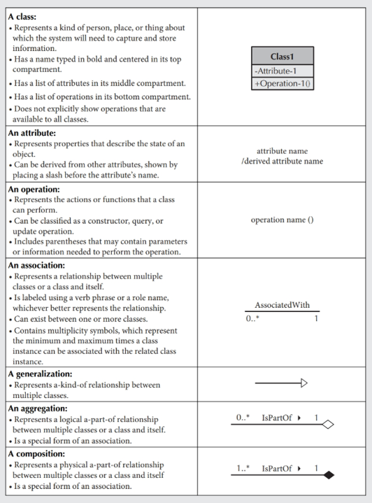
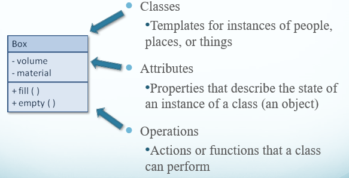
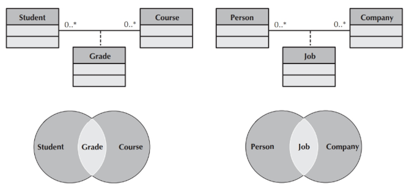
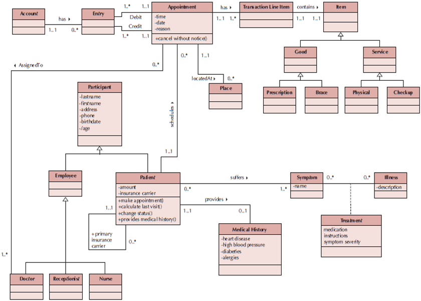

# Class Diagram

## Attributes

- Properties of a class
  - Person: last name, first name, address, etc.
- Attributes can be derived
  - Preceded with a slash (/)
  - e.g., age is derived from date of birth
- Visibility of an attribute:
  - Restricts access to attributes to ensure consistency
- Public attributes (+): visible to all classes
- Private attributes (-): visible only to an instance of the class in which they are defined
- Protected attributes (#): visible only to an instance of the class in which they are defined and its descendants

## Example

