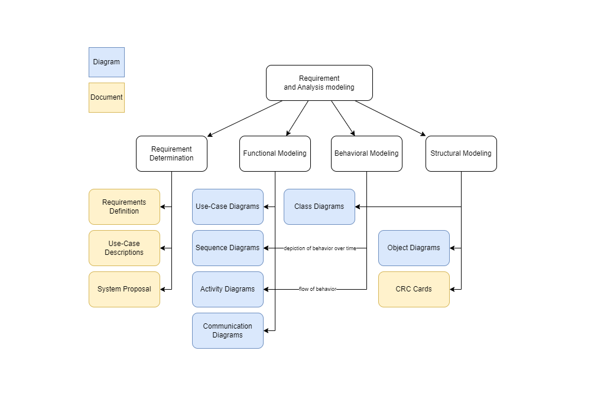

# Table of Contents

- [Requirements Definition](Requirements_Definition.md)
- [Use Case Descriptions](Use_Case_Descriptions.md)
- [The System Proposal](The_System_Proposal.md)
- [Use Case Diagrams](Use_Case_Diagrams.md)
- [Sequence Diagrams](Sequence_Diagrams.md)
- [Activity Diagram](Activity_Diagram.md)
- [Communication Diagram](Communication_Diagram.md)
- [Class Diagram](Class_Diagram.md)
- [Object Diagrams](Object_Diagrams.md)
- [CRC Cards](CRC_Cards.md)
- [CRUDE Analysis](CRUDE_Analysis.md)
