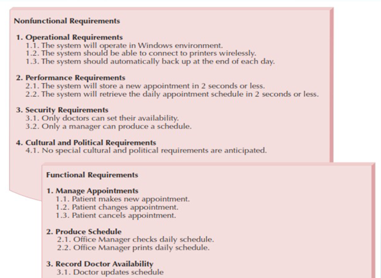

# Requirements Definition

# Types:

## Functional:

- relates to a process or data (ability to search for available inventory, report actual and budgeted expenses, etc)
- the degree that the software meets the functional requirements (i.e., how much of the actual problem is solved by the software solution provided)

## Non-functional:

- relates to performance or usability (ability to access the system using a Web browser)
- operational, performance, security, cultural, and political characteristics
- associated with the efficiency, maintainability, portability, reliability, reusability, testability, and usability quality dimensions.
- associated primarily with the actual detailed design and implementation of the system

# Requirements Definition

- Functional & non-functional requirements listed in outline format
- May be prioritized
- Provides information needed in subsequent workflows
- Defines the scope of the system
- Globalization (a global information supply chain generates a large number of additional nonfunctional requirements)

