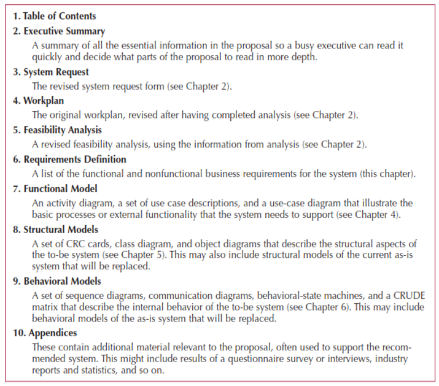

# The System Proposal

## Combines all material created in planning & analysis

Included sections:

- Executive summary
  - Provides all critical information in summary form
  - Helps busy executives determine which sections they need to read in more detail
- The system request
- The workplan
- The feasibility analysis
- The requirements definition
- Current models of the system (expected to evolve)

Analysis determines the business needs

Design activities focus on how to build the system

- Major activity is to evolve the models into a design
- Goal is to create a blueprint for the design that makes sense to implement
- Determine how and where data will be stored
- Determine how the user will interface with the system (user interface, inputs, and outputs)
- Decide on the physical architecture

Analysis and design phases are highly interrelated and may require much "going back and forth"

