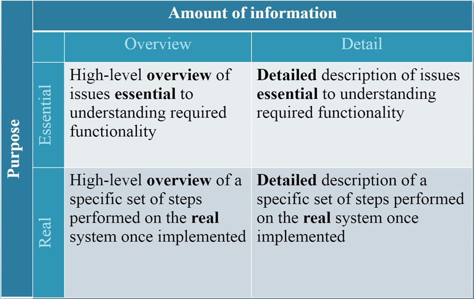

# Use Case Description

## Overview:

Name, ID Number, Type, Primary Actor, Brief Description, Importance
Level, Stakeholder(s), Trigger(s)

- The use-case name should be a verb–noun phrase (e.g., Make Old Patient Appt).
- The use-case ID number provides a unique way to find every use case and also
  enables the team to trace design decisions back to a specific requirement.
- The use-case type is either overview or detail and essential or real.
- The primary actor is usually the trigger of the use case—the person or thing that
  starts the execution of the use case. The primary purpose of the use case is to meet
  the goal of the primary actor.
- The brief description is typically a single sentence that describes the essence of the
  use case.
- The importance level can be used to prioritize the use cases. The importance level
  enables the users to explicitly prioritize which business functions are most
  important and need to be part of the first version of the system and which are less
  important and can wait until later versions if necessary. The importance level can
  use a fuzzy scale, such as high, medium, and low. It can also be done more formally
  using a weighted average of a set of criteria.

Type of Use Case: `Essential`, `Real`, `Overview`, `Detail`

