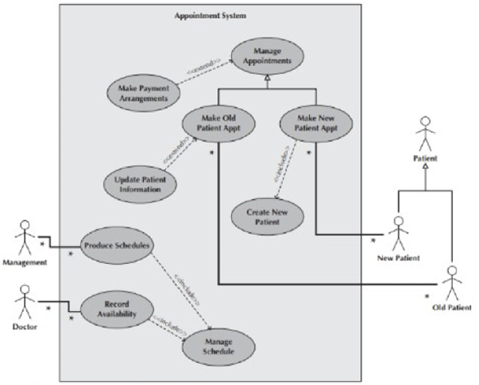
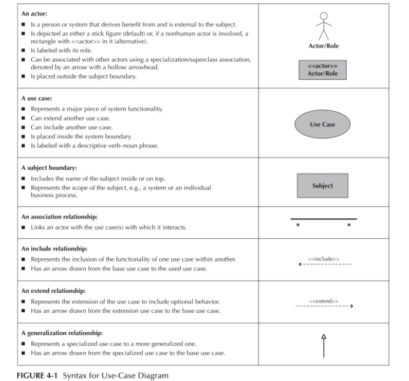
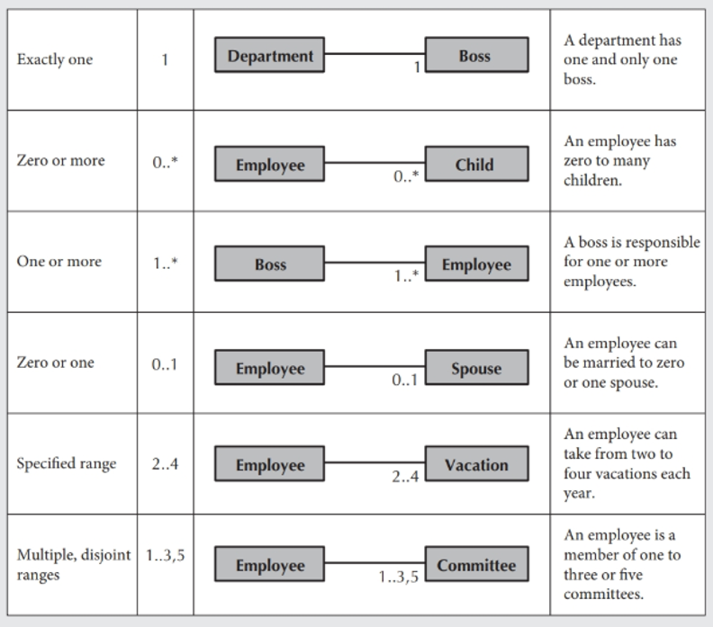

# Use Case Diagrams

- The primary driver for all UML diagramming techniques
- Depicts activities performed by the users
- Describe basic functions of the system:
  - What the user can do
  - How the system responds
- Use cases are building blocks for continued design activities
- Each use-case describes 1 and only 1 function
- A use case may contain several paths that a user can take while interacting with the system, each possible execution path through the use case is referred to as a scenario

